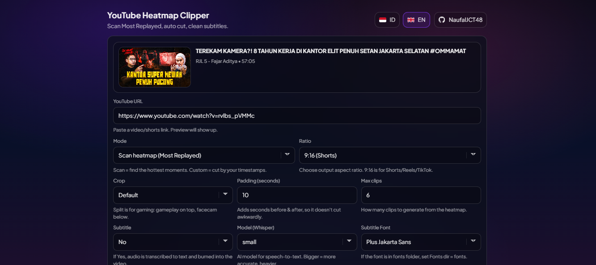
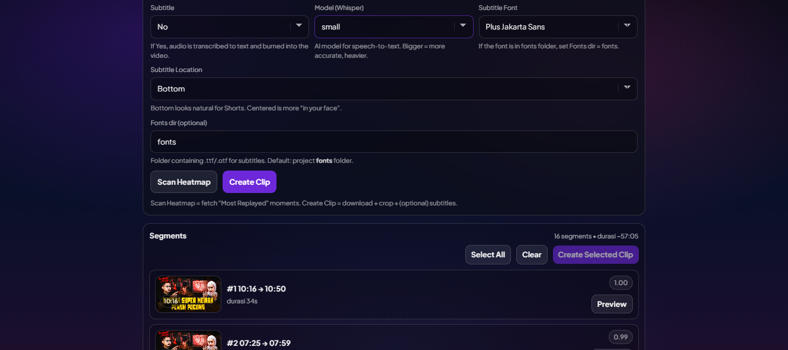
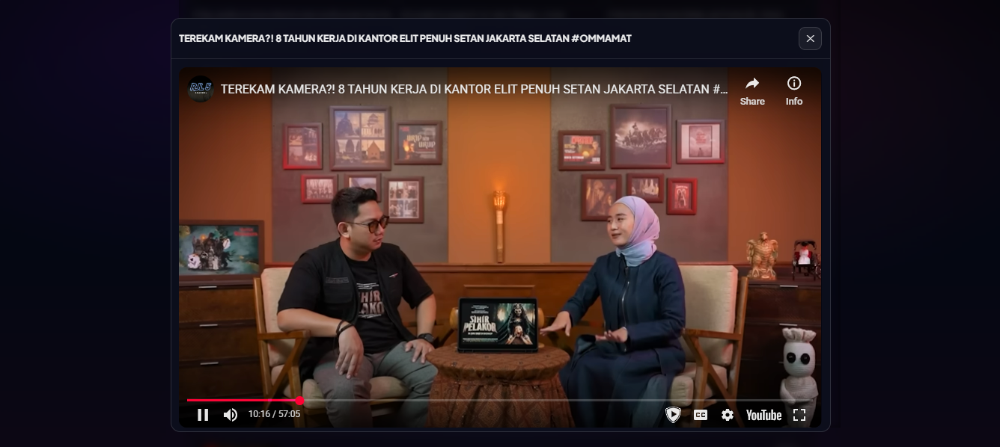
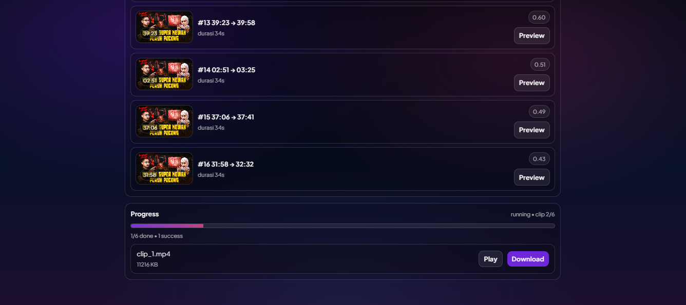
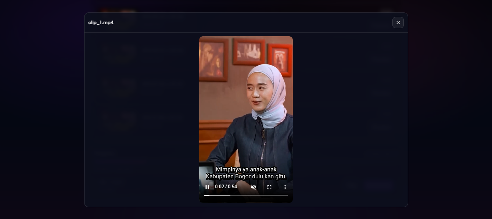

# YouTube Heatmap Clipper

Web app buat scan heatmap YouTube (Most Replayed) lalu bikin clip otomatis (vertical-ready) dengan opsi subtitle AI.

Ini versi web dari proyek original: https://github.com/0xACAB666/yt-heatmap-clipper (yang CLI-nya galak, yang web-nya lebih “manusiawi”).

## Preview

| | |
| --- | --- |
|  |  |
|  |  |
|  | |

## Fitur

### Core Features
- Scans YouTube videos (URL)
- Extracts YouTube Most Replayed (heatmap) segments
- Automatically selects high-engagement moments
- Configurable pre and post padding for each clip
- Outputs 9:16 vertical video format (720x1280)
- No YouTube API key required
- Supports standard YouTube videos and Shorts

### Advanced Features

- 3 Crop Modes:
  - Default: Center crop from original video
  - Split Left: Top = center content, Bottom = bottom-left (facecam)
  - Split Right: Top = center content, Bottom = bottom-right (facecam)
- AI Auto Subtitle (Faster-Whisper):
  - 4-5x faster than standard Whisper
  - Support for Indonesian language (and 99+ languages)
  - Multiple model sizes: tiny, base, small, medium, large
  - Automatic transcription and subtitle burning
  - Customizable subtitle style

### Web UI Extras

- Web UI (tanpa CLI) buat scan + clip
- Preview metadata video (judul, channel, durasi, thumbnail)
- Scan Most Replayed → list segments + preview per segment
- Select segments (multi select) + tombol Create Selected Clip
- Custom start/end (manual) buat potong satu range
- Output ratio: 9:16, 1:1, 16:9, original
- Subtitle (opsional):
  - Faster-Whisper model selection (tiny → large-v3)
  - Pilih font (Plus Jakarta Sans / Roboto / Montserrat / Arial / Custom)
  - Pilih lokasi subtitle (Bottom / Centered)
  - Fonts dir support (folder fonts berisi .ttf/.otf)

## Requirements

- Python 3.8+
- FFmpeg (wajib)
- Internet connection
- Optional: `faster-whisper` (kalau subtitle ON)

## Install (Windows)

```powershell
python -m pip install -r requirements.txt
python -m pip install faster-whisper
```

Kalau nggak butuh subtitle, skip `faster-whisper`.

## Run Web App

```powershell
python webapp.py
```

Buka:

- http://127.0.0.1:5000/

## Cara Pakai (Web)

1. Tempel YouTube URL → otomatis muncul preview
2. Mode:
   - Scan heatmap: klik Scan Heatmap → pilih segment → Create Selected Clip
   - Custom: isi Start/End → Buat Clip
3. Set Ratio, Crop, Padding, Subtitle (opsional)
4. Progress panel bakal nampilin output + tombol Play/Download

## Run CLI (opsional)

```powershell
python run.py --url "https://www.youtube.com/watch?v=VIDEO_ID" --crop default --subtitle y --whisper-model small --subtitle-font "Plus Jakarta Sans" --subtitle-fontsdir "fonts" --subtitle-location bottom --ratio 9:16
```

Argumen penting:

- `--crop`: default | split_left | split_right
- `--ratio`: 9:16 | 1:1 | 16:9 | original
- `--subtitle`: y | n
- `--whisper-model`: tiny | base | small | medium | large-v3
- `--subtitle-font`: nama font (mis. Poppins)
- `--subtitle-fontsdir`: folder font .ttf/.otf (default: fonts)
- `--subtitle-location`: bottom | center

## Fonts

- Taruh font di folder `fonts/` (mis. `fonts/Poppins/Poppins-Regular.ttf`)
- Isi Fonts dir jadi `fonts`
- Pilih font dari dropdown atau Custom (isi nama family font, contoh: `Poppins`)

## FFmpeg

FFmpeg harus bisa dipanggil dari PATH. Di Windows, app juga coba auto-detect kalau FFmpeg di-install via WinGet.

### Whisper Model Comparison

| Model        | Size   | RAM     | Speed (60s) | Accuracy  | Best For                |
| ------------ | ------ | ------- | ----------- | --------- | ----------------------- |
| **tiny**     | 75 MB  | ~500 MB | ~5-7s       | Good      | Quick clips, low-end PC |
| **base**     | 142 MB | ~700 MB | ~8-10s      | Better    | General purpose         |
| **small**    | 466 MB | ~1.5 GB | ~15-20s     | Great     | Quality content         |
| **medium**   | 1.5 GB | ~3 GB   | ~40-50s     | Excellent | Professional work       |
| **large-v3** | 2.9 GB | ~6 GB   | ~90-120s    | Best      | Production quality      |

> **Recommendation**: Use `tiny` for speed, `small` for quality balance

---

## Output

### Video Specifications

- **Format**: MP4 (H.264 video + AAC audio)
- **Resolution**: 720x1280 (9:16 vertical)
- **Video Codec**: libx264, CRF 26, ultrafast preset
- **Audio Codec**: AAC, 128 kbps
- **Subtitle**: Burned-in (if enabled), white text with black outline

### File Naming

```
clips/
├── clip_1.mp4
├── clip_2.mp4
└── clip_3.mp4
```

Clips are numbered based on their engagement score (highest first).

---

## Crop Mode Visualization

### Mode 1: Default (Center Crop)

```
Original Video (16:9)         Output (9:16)
┌─────────────────────┐       ┌──────┐
│   [   CONTENT   ]   │  -->  │CONTENT│
└─────────────────────┘       └──────┘
       crop center             full height
```

### Mode 2: Split Left (Facecam Bottom-Left)

```
Original Video (16:9)                Output (9:16)
┌─────────────────────────┐         ┌──────────┐
│                         │         │  GAME    │ 960px
│       GAME AREA         │   -->   │ CONTENT  │
│  [👤]                   │         ├──────────┤
└─────────────────────────┘         │ 👤 FACE  │ 350px
    facecam bottom-left             └──────────┘
```

### Mode 3: Split Right (Facecam Bottom-Right)

```
Original Video (16:9)                Output (9:16)
┌─────────────────────────┐         ┌──────────┐
│                         │         │  GAME    │ 960px
│       GAME AREA         │   -->   │ CONTENT  │
│                   [👤]  │         ├──────────┤
└─────────────────────────┘         │ FACE 👤  │ 350px
    facecam bottom-right            └──────────┘
```

---

## Troubleshooting

### FFmpeg not found

```bash
# Windows: Download from https://ffmpeg.org/download.html
# Add to PATH or place ffmpeg.exe in script directory

# macOS:
brew install ffmpeg

# Linux:
sudo apt install ffmpeg
```

### No high-engagement segments found

- Video might not have "Most Replayed" data yet (needs views/engagement)
- Try lowering `MIN_SCORE` (e.g., from 0.40 to 0.30)
- Check if video URL is correct

### Subtitle generation fails

- Ensure internet connection for first-time model download
- Check available RAM (whisper needs ~500MB-2GB depending on model)
- Try smaller model: change `WHISPER_MODEL` from `small` to `tiny`

### Slow transcription

- Use smaller model (`tiny` instead of `small`)
- Faster-Whisper is already 4-5x faster than standard Whisper
- Consider upgrading RAM or using GPU version

### Video download fails

- Check internet connection
- Verify YouTube URL is accessible
- Some videos might be region-locked or have restrictions
- Try updating yt-dlp: `pip install -U yt-dlp`

---

## Tips & Best Practices

### For Gaming Content

- Use **Split Right** or **Split Left** mode (facecam in corner)
- Keep `PADDING = 10` for context before/after action
- Use `small` or `base` model for accurate gaming terminology

### For Tutorial/Vlog Content

- Use **Default** center crop mode
- Increase `MAX_DURATION = 90` for longer explanations
- Enable subtitles with `tiny` model for fast processing

### For Fast-Paced Content

- Reduce `PADDING = 5` to keep clips tight
- Increase `MIN_SCORE = 0.50` for only peak moments
- Use `tiny` model to match quick content style

### Subtitle Customization

Edit line ~368 in `run.py` to customize subtitle style:

```python
# Current style (white text, black outline):
BorderStyle=1,Outline=3,Shadow=2,MarginV=30

# Large text:
FontSize=28,Outline=4

# Position higher (avoid facecam):
MarginV=400

# Different color (yellow):
PrimaryColour=&H00FFFF
```

---

## Contributing

Contributions are welcome! Feel free to:

- Report bugs
- Suggest features
- Submit pull requests
- Improve documentation

---

## License

MIT License

---

## Credits & Special Thanks

- Special thanks to proyek original (versi CLI) yang jadi pondasi: https://github.com/0xACAB666/yt-heatmap-clipper
- [yt-dlp](https://github.com/yt-dlp/yt-dlp) - YouTube video downloader
- [FFmpeg](https://ffmpeg.org/) - Video processing
- [Faster-Whisper](https://github.com/guillaumekln/faster-whisper) - AI transcription
- [OpenAI Whisper](https://github.com/openai/whisper) - Speech recognition model

---

## Support

If you find this tool useful, please ⭐ star this repository!

For issues and questions, please open an issue on GitHub.
